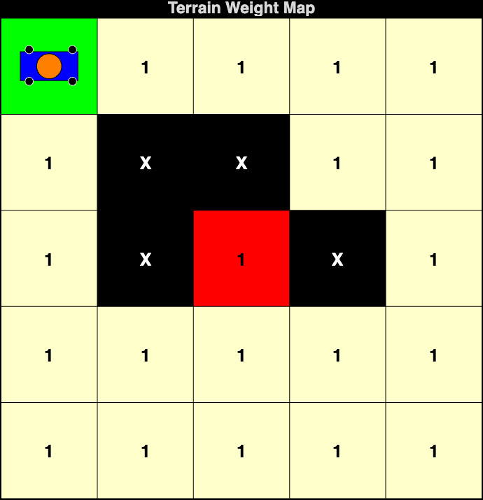
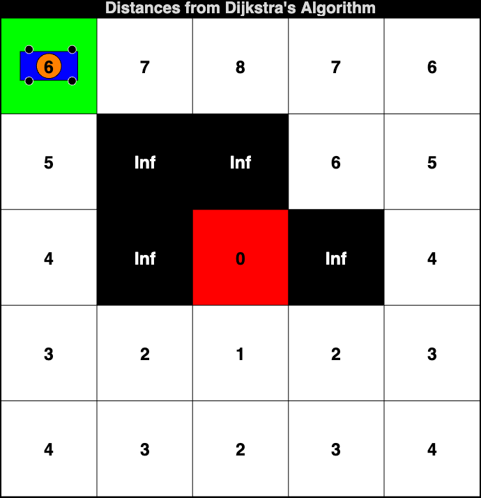
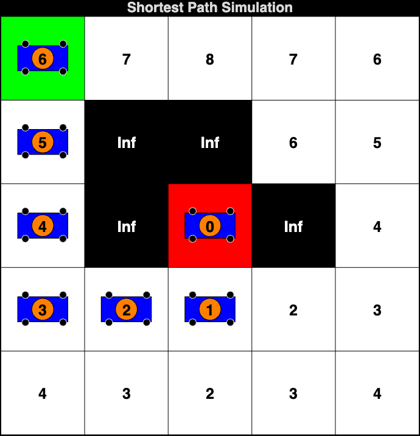

# Dijkstra's Pathfinding Algorithm Simulation

This project implements **Dijkstra's Algorithm** for pathfinding in a grid-based environment, simulating the movement of a robot from a start cell to a goal cell while avoiding obstacles. The simulation visualizes the grid, the terrain weight map, the distances computed by Dijkstra's algorithm, and the shortest path found. Dijkstra's algorithm generalizes BFS to support **weighted terrain** where different cells have different traversal costs.

## Table of Contents
- [Introduction](#introduction)
- [Features](#features)
- [Requirements](#requirements)
- [Usage](#usage)
  - [Parameters](#parameters)
  - [Example](#example)
- [How Dijkstra's Algorithm Works](#how-dijkstras-algorithm-works)
- [File Structure](#file-structure)
- [Results](#results)
  - [Terrain Weight Map](#terrain-weight-map)
  - [Distances from Dijkstra's Algorithm](#distances-from-dijkstras-algorithm)
  - [Shortest Path](#shortest-path)
  - [Shortest Path Simulation](#shortest-path-simulation)
- [Weighted Terrain Demo](#weighted-terrain-demo)
- [License](#license)
- [Acknowledgments](#acknowledgments)
- [References](#references)

## Introduction
This project implements a robot pathfinding simulation using Dijkstra's algorithm on a grid-based environment. Dijkstra's algorithm uses a **priority queue** to always expand the lowest-cost node first, guaranteeing the optimal shortest path. By default, the simulation uses **uniform weights** (all cells cost 1), producing the same result as Grassfire (BFS). However, the algorithm fully supports **non-uniform terrain costs** — an optional weighted terrain demo is included to showcase this unique capability.

## Features
- **Grid Visualization**: Displays a grid with start (green), goal (red), and obstacle (black) cells.
- **Weighted Terrain Support**: Algorithm supports non-uniform terrain costs (different cells can have different traversal costs).
- **Weight Map Visualization**: Color-coded display showing terrain costs for each cell.
- **Distance Calculation**: Computes weighted shortest distances from the goal using a priority queue.
- **Shortest Path Simulation**: Visualizes the robot's movement along the cost-optimal path to the goal.
- **Robot Representation**: The robot is represented as a blue rectangle with wheels and an orange top mount.
- **MATLAB Graphics**: Utilizes MATLAB's graphical capabilities to create an interactive simulation experience.

## Requirements
- MATLAB (preferably R2018b or later)

## Usage
Clone this repository and run the `start_simulation.m` file, providing the grid dimensions, start cell, goal cell, and obstacles as input parameters.

### Parameters
To run the simulation, call the `start_simulation` function with the appropriate parameters:

```matlab
start_simulation(m, n, startCell, goalCell, obstacles)
```

- `m`: Number of rows in the grid.
- `n`: Number of columns in the grid.
- `startCell`: Linear index of the start cell (row-major order).
- `goalCell`: Linear index of the goal cell (row-major order).
- `obstacles`: Array of linear indices representing obstacle cells.

### Example

```matlab
m = 5; % Number of rows
n = 5; % Number of columns
startCell = 1; % Start cell index
goalCell = 13; % Goal cell index
obstacles = [7, 8, 12, 14]; % Obstacle cells

start_simulation(m, n, startCell, goalCell, obstacles);
```

## How Dijkstra's Algorithm Works
Dijkstra's algorithm finds the shortest weighted path using a **priority queue**:

1. **Initialize**: Set the goal cell distance to `0`, all others to `Inf`. Mark obstacles as impassable.
2. **Priority Queue**: Always expand the cell with the **smallest distance** first.
3. **Relax Edges**: For each neighbor, compute `new_cost = current_distance + weight(neighbor)`. Update if shorter.
4. **Repeat**: Continue until all reachable cells are processed.
5. **Path Extraction**: From the start cell, follow the gradient of decreasing distances to reach the goal.

### Algorithm Characteristics
| Property | Value |
|----------|-------|
| Search Strategy | Lowest-cost-first expansion from goal |
| Data Structure | Priority Queue (min-heap) |
| Movement | 4-directional (up, down, left, right) |
| Edge Costs | Weighted (supports variable costs per cell) |
| Optimality | Guaranteed (shortest weighted path) |
| Completeness | Complete (finds path if one exists) |

### Relationship to Grassfire (BFS)
Dijkstra's algorithm is a **generalization** of the Grassfire (BFS) algorithm. When all terrain weights are equal (uniform cost = 1), Dijkstra produces the **same distances and path** as Grassfire. The key difference is the data structure: Dijkstra uses a **priority queue** (ordered by cost) instead of a **FIFO queue** (ordered by insertion). This distinction becomes important when cells have non-uniform costs.

### Simulation Workflow
The simulation runs in 4 phases:
1. **Problem Statement** — Grid display with start, goal, and obstacles.
2. **Terrain Weight Map** — Color-coded visualization of terrain costs per cell.
3. **Distance Display** — Weighted distances from each cell to the goal.
4. **Path Simulation** — Animated robot following the cost-optimal path.

## File Structure
The project consists of the following MATLAB functions:

- **`start_simulation.m`**: The main entry point that initiates the 4-phase simulation workflow. Defines the terrain weight matrix (uniform by default, with an optional weighted demo).

- **`display_grid.m`**: Displays the grid with the start cell (green), goal cell (red), and obstacles (black).

- **`dijkstra_algorithm.m`**: Implements Dijkstra's algorithm using a priority queue. Computes weighted shortest distances from the goal cell, considering terrain weights and obstacles. Returns distances, cells explored count, and exploration order.

- **`display_weights.m`**: Visualizes the terrain weight map with color-coded cells. Lighter colors indicate low-cost terrain, darker colors indicate high-cost terrain.

- **`display_distances.m`**: Overlays the computed weighted distances on the grid, showing the cost from each cell to the goal.

- **`shortest_path.m`**: Animates the robot moving step-by-step along the cost-optimal path by following the gradient of decreasing Dijkstra distances.

- **`draw_robot.m`**: Draws the robot's representation on the grid. The robot features a blue rectangular body, black wheels, and an orange circular top mount.

- **`index_to_rowcol.m`**: Converts a linear cell index to its corresponding row and column indices using **row-major order** (left-to-right, top-to-bottom).

## Results

### Terrain Weight Map


### Distances from Dijkstra's Algorithm


### Shortest Path


### Shortest Path Simulation


## Weighted Terrain Demo
To see Dijkstra handle non-uniform terrain costs (its unique advantage over BFS), open `start_simulation.m` and uncomment the weighted terrain block:

```matlab
% Uncomment this block in start_simulation.m:
weights = [1 1 2 1 1;
           8 1 1 1 1;
           8 1 1 1 1;
           1 1 1 1 1;
           1 2 1 1 1];
```

With these weights, cells `(2,1)` and `(3,1)` cost **8** to enter. Dijkstra will find it cheaper to take a **longer but lighter-weight path** around the right side of the grid, even though it involves more hops. This demonstrates why Dijkstra's algorithm is essential for environments with varying terrain costs.

## License
This project is licensed under the MIT License. See the LICENSE file for details.

## Acknowledgments
- Inspired by algorithms for pathfinding and robotics.

## References
1. **Dijkstra's Algorithm**:
   - E. W. Dijkstra, "A note on two problems in connexion with graphs," *Numerische Mathematik*, vol. 1, pp. 269-271, 1959.
   - [Wikipedia: Dijkstra's algorithm](https://en.wikipedia.org/wiki/Dijkstra%27s_algorithm)

2. **Priority Queues**:
   - T. H. Cormen, C. E. Leiserson, R. L. Rivest, and C. Stein, *Introduction to Algorithms*, 3rd ed. MIT Press, 2009.

3. **Pathfinding Algorithms**:
   - R. Hart, N. Nilsson, and B. Raphael, "A Formal Basis for the Heuristic Determination of Minimum Cost Paths," *IEEE Transactions on Systems Science and Cybernetics*, vol. 4, no. 2, pp. 100-107, 1968.

4. **Mobile Robots**:
   - B. Siciliano et al., *Springer Handbook of Robotics*, 2nd ed. Springer, 2016.
   - R. Siegwart, I. R. Nourbakhsh, and D. Scaramuzza, *Introduction to Autonomous Mobile Robots*, 2nd ed. MIT Press, 2011.

5. **MATLAB Graphics**:
   - MATLAB Documentation: [Graphics](https://www.mathworks.com/help/matlab/graphics.html)
